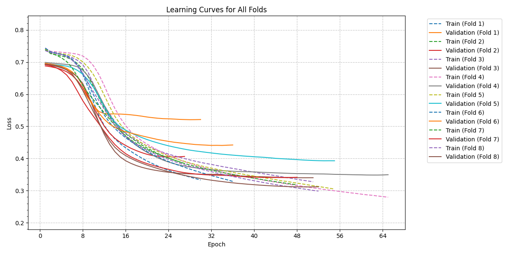
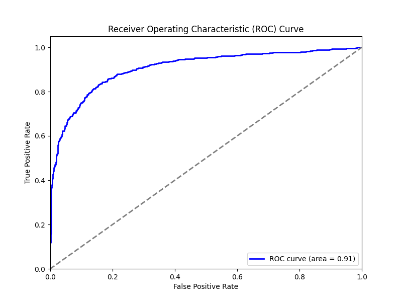

# Alzheimer's Disease Prediction

This repository contains a dataset and a comprehensive analysis framework for predicting Alzheimer's Disease using various machine learning and deep learning models.

## Main Objective
The primary objective of this analysis is to explore the factors associated with Alzheimer's Disease, develop predictive models, and conduct statistical analyses to provide insights and predictive capabilities. The focus will be on a specific type of Deep Learning algorithm to improve prediction accuracy and provide valuable information to stakeholders, such as healthcare professionals and researchers.

## Data Summary
The dataset includes demographic details, lifestyle factors, medical history, clinical measurements, cognitive and functional assessments, symptoms, and diagnosis information. The data covers a wide range of features essential for understanding and predicting Alzheimer's Disease.   

## About the Dataset

This dataset contains extensive health information for 2,149 patients, each uniquely identified with IDs ranging from 4751 to 6900. The dataset includes the following features:

### Patient Information
- **Patient ID**: A unique identifier assigned to each patient (4751 to 6900).

### Demographic Details
- **Age**: The age of the patients ranges from 60 to 90 years.
- **Gender**: Gender of the patients, where 0 represents Male and 1 represents Female.
- **Ethnicity**: The ethnicity of the patients, coded as follows:
- **EducationLevel**: The education level of the patients, coded as follows:
### Lifestyle Factors
- **BMI**: Body Mass Index of the patients, ranging from 15 to 40.
- **Smoking**: Smoking status, where 0 indicates No and 1 indicates Yes.
- **AlcoholConsumption**: Weekly alcohol consumption in units, ranging from 0 to 20.
- **PhysicalActivity**: Weekly physical activity in hours, ranging from 0 to 10.
- **DietQuality**: Diet quality score, ranging from 0 to 10.
- **SleepQuality**: Sleep quality score, ranging from 4 to 10.

### Medical History
- **FamilyHistoryAlzheimers**: Family history of Alzheimer's Disease, where 0 indicates No and 1 indicates Yes.
- **CardiovascularDisease**: Presence of cardiovascular disease, where 0 indicates No and 1 indicates Yes.
- **Diabetes**: Presence of diabetes, where 0 indicates No and 1 indicates Yes.
- **Depression**: Presence of depression, where 0 indicates No and 1 indicates Yes.
- **HeadInjury**: History of head injury, where 0 indicates No and 1 indicates Yes.
- **Hypertension**: Presence of hypertension, where 0 indicates No and 1 indicates Yes.

### Clinical Measurements
- **SystolicBP**: Systolic blood pressure, ranging from 90 to 180 mmHg.
- **DiastolicBP**: Diastolic blood pressure, ranging from 60 to 120 mmHg.
- **CholesterolTotal**: Total cholesterol levels, ranging from 150 to 300 mg/dL.
- **CholesterolLDL**: Low-density lipoprotein cholesterol levels, ranging from 50 to 200 mg/dL.
- **CholesterolHDL**: High-density lipoprotein cholesterol levels, ranging from 20 to 100 mg/dL.
- **CholesterolTriglycerides**: Triglycerides levels, ranging from 50 to 400 mg/dL.

### Cognitive and Functional Assessments
- **MMSE**: Mini-Mental State Examination score, ranging from 0 to 30. Lower scores indicate cognitive impairment.
- **FunctionalAssessment**: Functional assessment score, ranging from 0 to 10. Lower scores indicate greater impairment.
- **MemoryComplaints**: Presence of memory complaints, where 0 indicates No and 1 indicates Yes.
- **BehavioralProblems**: Presence of behavioral problems, where 0 indicates No and 1 indicates Yes.
- **ADL**: Activities of Daily Living score, ranging from 0 to 10. Lower scores indicate greater impairment.

### Symptoms
- **Confusion**: Presence of confusion, where 0 indicates No and 1 indicates Yes.
- **Disorientation**: Presence of disorientation, where 0 indicates No and 1 indicates Yes.
- **PersonalityChanges**: Presence of personality changes, where 0 indicates No and 1 indicates Yes.
- **DifficultyCompletingTasks**: Presence of difficulty completing tasks, where 0 indicates No and 1 indicates Yes.
- **Forgetfulness**: Presence of forgetfulness, where 0 indicates No and 1 indicates Yes.

### Target Prediction
- **Diagnosis**: Diagnosis status for Alzheimer's Disease, where 0 indicates No and 1 indicates Yes.

## Data Exploration and Cleaning
Initial data exploration involved checking for missing values, outliers, and inconsistencies. Feature engineering steps included scaling numerical features, one-hot encoding categorical features, and undersampling to address class imbalance.

Class distribution before resampling:
| Diagnosis | Samples |
|-----------|---------|
| 0         | 1389    |     
| 1         | 760     |

Class distribution after resampling:
| Diagnosis | Samples |
|-----------|---------|
| 0         | 760    |     
| 1         | 760     |


## Features Selection:
The SelectKBest method from the sklearn.feature_selection module is a feature selection technique that selects the top k features based on a statistical measure of their relevance to the target variable. 

## Model Training and Evaluation
We used a neural network model and conducted a grid search to find the best hyperparameters, including the number of layers, nodes, and learning rate. The grid search was performed using various configurations. Stratified cross-validation with 8 folds and downsampling for preprocessing were utilized to ensure balanced class distribution.   
  
We also experimented with 5 simplier and less complex models such as Logistic Regression, K-Nearest Neighbors, Support Vector Machine, Random Forrest, and Gradient Boosing with cross-validation with 8 folds.   

## Key Findings and Insights

### Classification Report - Neural Network (NN) (Top 10 Features)
| Class        | Precision | Recall | F1-Score | Support  |
|--------------|-----------|--------|----------|----------|
| No Alzheimer | 0.901     | 0.910  | 0.905    | 760      |
| Alzheimer    | 0.909     | 0.900  | 0.904    | 760      |
| accuracy     |           |        | 0.905    | 1520     |
| macro avg    | 0.905     | 0.905  | 0.905    | 1520     |
| weighted avg | 0.905     | 0.905  | 0.905    | 1520     |

### Best Configuration
- **Layers**: [32, 32, 32]
- **Learning Rate**: 0.01
- **F1 Score**: 0.905

----------------------------------------------------------------------------






----------------------------------------------------------------------------

### Comparison of F1 Scores
| Complexity | Model                   | Parameters (All Features) | Parameters (Top 10 Features) | F1 Score (All Features) | F1 Score (Top 10 Features) |
|------------|-------------------------|---------------------------|------------------------------|-------------------------|----------------------------|
| 1          | Logistic Regression     | C = 10                    | C = 10                       | 0.812                   | 0.821                      |
| 2          | K-Nearest Neighbors     | k = 50                    | k = 3                        | 0.757                   | 0.823                      |
| 3          | Support Vector Machine  | C = 1                     | C = 5                        | 0.815                   | 0.888                      |
| 4          | Random Forest           | Estimators = 500          | Estimators = 200             | 0.922                   | 0.928                      |
| 5          | Gradient Boosting       | Estimators = 100          | Estimators = 100             | 0.919                   | 0.922                      |
| 6          | Neural Network          |                           |                              |                         | 0.905                      |

### Top 15 Features Importance (Random Forest)
These are the most constributing variables or features that predict positive diagnosis of Alzheimer:
|       | Feature                    | Importance |
|-------|----------------------------|------------|
| 1     | Functional Assessment      | 0.1812     |
| 2     | ADL                        | 0.1603     |
| 3     | MMSE                       | 0.1304     |
| 4     | Memory Complaints          | 0.0827     |
| 5     | Behavioral Problems        | 0.0490     |
| 6     | BMI                        | 0.0310     |
| 7     | Sleep Quality              | 0.0293     |
| 8     | Diet Quality               | 0.0293     |
| 9     | Cholesterol HDL            | 0.0287     |
| 10    | Cholesterol Triglycerides  | 0.0285     |
| 11    | Alcohol Consumption        | 0.0276     |
| 12    | Physical Activity          | 0.0269     |
| 13    | Cholesterol Total          | 0.0267     |
| 14    | Cholesterol LDL            | 0.0260     |
| 15    | Age                        | 0.0244     |


### Recommended Model
The best-performing model was the Random Forest, especially when using the top 10 features, achieving an F1 score of 0.9285. This model demonstrated superior performance in predicting Alzheimer's Disease.

## Next Steps
Future analysis could involve:
- **Incorporating Additional Data**: Including more detailed genetic information or longitudinal data could enhance the model's predictive power.
- **Model Refinement**: Experimenting with other machine learning algorithms or ensemble methods, as well as setting different Neural Network hyperparameters that could further improve accuracy.
- **Clinical Validation**: Collaborating with healthcare professionals to validate the model's predictions in a clinical setting.

## Conclusion
This analysis provides a robust framework for predicting Alzheimer's Disease using health data. The findings offer valuable insights into the key factors associated with the disease and demonstrate the potential of machine learning models in supporting healthcare decision-making.


## Setup

Scripts:   
- `data_preprocessing.py`: Loads and preprocesses the data, including scaling and resampling.   
- `feature_selection.py`: Selects the top 10 features using `SelectKBest`.   
- `simple_model_evaluation.py`: Evaluates simple models using all features and the top 10 features, saving the best F1 scores.   
- `feature_importance.py`: Trains a Random Forest model and prints the feature importance.   
- `layer_configurations.py`: Generates layer configurations and learning rates for the neural network.   
- `neural_network.py`: Trains and evaluates a flexible neural network model using the best configurations.   
- `main.py`: Main script to run all the above scripts in the correct order.   

1. Clone the repository:
    ```bash
    git clone https://github.com/reab5555/alzheimers-disease-prediction.git
    cd alzheimers-disease-prediction
    ```

2. Install the required packages:
    ```bash
    pip install pandas numpy scikit-learn imbalanced-learn tqdm matplotlib seaborn tabulate torch
    ```

### How to Run

1. Ensure the data file `alzheimers_dataset.csv` is in the correct path as specified in the `data_preprocessing.py` script.

2. Run the main script:
    ```bash
    python main.py
    ```

### Description of Scripts

- **device_check.py**: This script checks whether CUDA is available on the system and prints the device being used.
  
- **data_preprocessing.py**: This script loads the data from a CSV file, separates features and target, scales numerical features, and resamples the data to address class imbalance.

- **feature_selection.py**: This script uses `SelectKBest` to select the top 10 features based on their importance and resamples the selected features.

- **simple_model_evaluation.py**: This script evaluates several simple models (Logistic Regression, KNN, SVM, Random Forest, Gradient Boosting) using both all features and the top 10 features, performing cross-validation and saving the best F1 scores.

- **feature_importance.py**: This script trains a Random Forest model using the full dataset, prints the feature importance, and checks whether the top 10 features are used.

- **layer_configurations.py**: This script generates different layer configurations and learning rates for the neural network, saving them to a JSON file.

- **neural_network.py**: This script trains a flexible neural network model using the configurations from `layer_configurations.py`, performs grid search with cross-validation to find the best configuration, plots learning curves, confusion matrix, and ROC curve, and saves the final trained model.

- **main.py**: This script sequentially runs all the above scripts in the correct order.

### Notes

- Ensure the data file `alzheimers_dataset.csv` is in the correct path as specified in the `data_preprocessing.py` script.
- Modify the file paths in the scripts if your directory structure is different.

### License

This project is licensed under the MIT License. See the `LICENSE` file for details.
